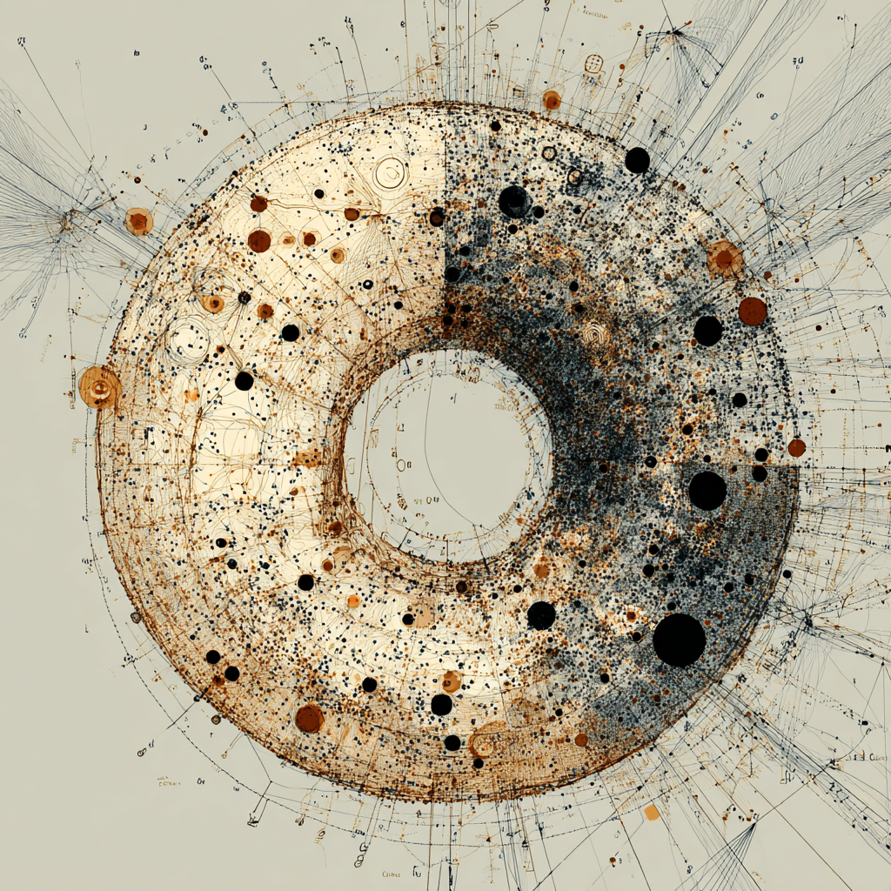

# BAIGEL 🥯

<div align="center">
  
</div>

**B**ridge for **A**gent **I**nterfaces and **G**eneral **E**verything **L**ayers

A universal front-end for AI agents that works with any standards-compliant implementation - MCP, A2A, AG-UI, OpenAI, and more. Named after the "everything bagel" from "Everything Everywhere All at Once" because it brings everything together in one interface.

## 🎯 Problem We're Solving

The AI agent ecosystem is fragmenting into incompatible implementations. Every UI needs custom code for each server, creating an N×M integration nightmare. BAIGEL provides a single, standards-compliant front-end that works with any protocol implementation through automatic discovery and protocol compliance.

## ✨ Key Features

- 🔍 **Automatic Discovery**: Probe any URL to discover MCP servers, A2A agents, and workflows
- 🔌 **Implementation Agnostic**: Full support for any standards-compliant MCP, A2A, Workflow, OpenAI server
- 🤖 **Universal Tool Execution**: Execute tools across any protocol implementation with auto-generated forms
- 💬 **Multi-Protocol Chat**: Chat with agents regardless of their server implementation
- 🎯 **Interface Detection**: Automatically detects if agents support chat, tools, or both
- ⚡ **Standards Compliant**: JSON-RPC 2.0 for MCP, proper A2A protocol implementation, OpenAPI support
- 🛠️ **Developer Friendly**: Clear separation between discovery, connection, and execution layers

## 🚀 Project Status

**Phase 2 Complete** ✅ - Discovery, connections, tool execution, and protocol adapters fully implemented

**Live Demo**: `pnpm dev` → http://localhost:3005

## 🚀 Getting Started

### Prerequisites
- Node.js 18+ 
- pnpm (recommended) or npm

### Installation

```bash
# Clone the repository
git clone https://github.com/jwynia/baigel.git
cd baigel

# Install dependencies
pnpm install

# Start development server  
cd code/apps/web
pnpm dev

# Open your browser
open http://localhost:3005
```

### Quick Start Guide

1. **🔍 Discover Agents**: Navigate to `/discovery` and enter a base URL to automatically discover available agents and services
2. **🔗 Add Connections**: Click "Add Connection" on discovered agents to convert them to working connections
3. **🛠️ Use Tools**: Access the tools interface for agents that provide executable functions
4. **💬 Chat**: Use the chat interface for conversational agents (A2A, OpenAI)
5. **⚙️ Manage**: Switch between connections and manage settings in `/settings`

### Try These Discovery Endpoints

```bash
# If you have a Mastra server running:
http://localhost:4111/               # MCP aggregator + A2A agents

# Any MCP-compatible server:
http://your-mcp-server/             # Individual MCP server

# OpenAI-compatible endpoints:  
http://your-openai-api/             # OpenAI or compatible API
```

## 🏗️ Architecture

BAIGEL uses a layered architecture for maximum extensibility:

```
┌─────────────────────────────────────┐
│         Discovery Layer             │  ← Multi-protocol probing & detection
├─────────────────────────────────────┤  
│       Connection Layer              │  ← Protocol adapters & session management  
├─────────────────────────────────────┤
│        Execution Layer              │  ← Universal tool execution & chat
├─────────────────────────────────────┤
│            UI Layer                 │  ← React components & state management
└─────────────────────────────────────┘
```

## 🔌 Protocol Support

| Protocol | Status | Features |
|----------|--------|----------|
| **MCP** | ✅ **Full Support** | JSON-RPC 2.0 sessions, tool execution, server aggregation |
| **A2A** | ✅ **Full Support** | Agent-to-agent communication, method pattern detection |  
| **Workflow** | ✅ **Full Support** | Mastra workflow discovery, execution metadata |
| **OpenAI** | ✅ **Full Support** | Function calling, chat completions, streaming |
| **AG-UI** | 🚧 **Planned** | Real-time streaming agent interfaces |

## 🛠️ Development

### Tech Stack

- **Framework**: Next.js 14 with App Router
- **Language**: TypeScript with strict mode
- **UI**: Shadcn UI + Radix primitives + Tailwind CSS  
- **State**: Zustand with localStorage persistence
- **Testing**: Vitest + React Testing Library

### Project Structure

```
code/apps/web/
├── app/                    # Next.js pages
│   ├── discovery/         # Agent discovery interface
│   ├── chat/              # Multi-protocol chat  
│   └── settings/          # Connection management
├── lib/
│   ├── discovery/         # Protocol detection & probing
│   ├── services/          # Protocol adapters & execution  
│   ├── stores/            # Application state
│   └── types/             # TypeScript definitions
└── components/            # React UI components
    ├── discovery/         # Discovery interface
    ├── connections/       # Connection management
    ├── tools/             # Tool execution forms
    └── chat/              # Chat interface
```

### Running Tests

```bash
# Run all tests
pnpm test

# Run with coverage
pnpm test:coverage  

# Type check
pnpm check-types

# Lint
pnpm lint
```

## 🤝 Contributing

We welcome contributions! Please:

1. Check existing issues or create new ones
2. Fork and create a feature branch  
3. Follow existing code patterns and TypeScript strict mode
4. Add tests for new features
5. Update documentation as needed
6. Submit a PR with clear description

## 📄 License

MIT License - see [LICENSE](LICENSE) file for details.

## 🙏 Acknowledgments

- **Everything Everywhere All at Once** - Inspiration for the "everything bagel" concept
- **MCP Protocol** - Model Context Protocol specification  
- **A2A Protocol** - Agent-to-Agent communication standard
- **Shadcn UI** - Beautiful, accessible component system
- **The AI agent community** - For creating the protocols we bridge

---

**BAIGEL**: Because every agent deserves a universal interface 🥯