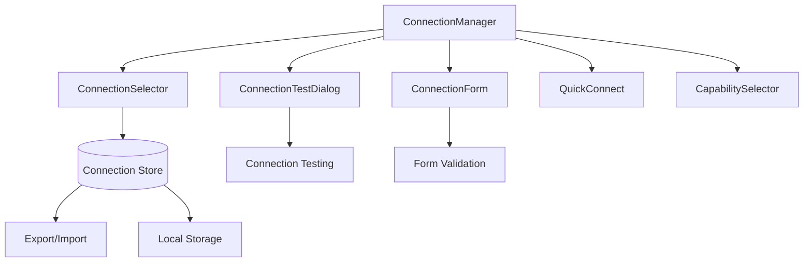

# Connection Management System

## Purpose
This document describes the comprehensive connection management system that handles protocol connections, authentication, testing, and lifecycle management across all supported protocols (MCP, A2A, OpenAI-compatible, Workflow services).

## Classification
- **Domain:** UI Systems
- **Stability:** Semi-stable
- **Abstraction:** Structural
- **Confidence:** Established

## Content

### System Overview

The Connection Management System is a fully-implemented, production-ready component system that provides:
- Visual connection management interface
- Real-time connection testing and validation
- Authentication configuration handling
- Protocol-agnostic connection abstractions
- Capability detection and selection
- Connection status monitoring and control

### Architecture



### Core Components

#### ConnectionManager (`/components/connections/ConnectionManager.tsx`)
**Purpose**: Central hub for managing all protocol connections

**Key Features**:
- Visual connection dashboard with cards for each configured connection
- Real-time status display (connected, disconnected, error, testing)
- Bulk operations (connect all, disconnect all)
- Connection lifecycle management (create, edit, test, delete)
- Protocol-specific metadata display
- Integration with connection store for persistence

**Props Interface**:
```typescript
interface ConnectionManagerProps {
  // No props - uses connection store internally
}
```

**Usage**:
```typescript
import { ConnectionManager } from '@/components/connections'

// In a page or parent component
<ConnectionManager />
```

#### ConnectionForm (`/components/connections/ConnectionForm.tsx`)
**Purpose**: Form interface for creating and editing connections

**Key Features**:
- Protocol-specific form fields
- Real-time validation
- Authentication method selection
- Capability configuration
- Form state management with error handling
- Protocol metadata integration

**Props Interface**:
```typescript
interface ConnectionFormProps {
  connection?: Connection | null;
  onSave: (connection: Connection) => void;
  onCancel: () => void;
}
```

#### ConnectionTestDialog (`/components/connections/ConnectionTestDialog.tsx`)
**Purpose**: Modal dialog for testing connection validity

**Key Features**:
- Real-time connection testing
- Detailed error reporting
- Protocol-specific test procedures
- Capability validation
- Authentication verification
- Performance metrics display

**Props Interface**:
```typescript
interface ConnectionTestDialogProps {
  connection: Connection;
  isOpen: boolean;
  onClose: () => void;
  onTestComplete: (result: ConnectionTestResult) => void;
}
```

#### ConnectionSelector (`/components/connections/ConnectionSelector.tsx`)
**Purpose**: Dropdown component for selecting active connections

**Key Features**:
- Protocol grouping
- Status indicators
- Quick switching between connections
- Recent connections prioritization
- Search and filtering

**Props Interface**:
```typescript
interface ConnectionSelectorProps {
  value?: string;
  onSelect: (connectionId: string) => void;
  protocols?: ProtocolType[];
  placeholder?: string;
}
```

#### QuickConnect (`/components/connections/QuickConnect.tsx`)
**Purpose**: Rapid connection setup for common use cases

**Key Features**:
- Pre-configured connection templates
- One-click connection setup for popular services
- Auto-discovery integration
- Guided setup flows
- Protocol recommendations

**Props Interface**:
```typescript
interface QuickConnectProps {
  onConnectionCreated: (connection: Connection) => void;
  preferredProtocols?: ProtocolType[];
}
```

#### CapabilitySelector (`/components/connections/CapabilitySelector.tsx`)
**Purpose**: Interface for selecting and configuring connection capabilities

**Key Features**:
- Capability discovery from connected services
- Feature toggles for available capabilities
- Capability compatibility checking
- Performance impact indicators
- Required vs optional capability distinction

**Props Interface**:
```typescript
interface CapabilitySelectorProps {
  connection: Connection;
  onCapabilitiesChange: (capabilities: Capability[]) => void;
  availableCapabilities: Capability[];
}
```

### State Management

#### Connection Store (`/lib/stores/connections.ts`)
Zustand-based state management with the following features:

**State Structure**:
```typescript
interface ConnectionState {
  connections: Connection[];
  activeConnectionId: string | null;
  testResults: Map<string, ConnectionTestResult>;
  isConnecting: boolean;
  errors: Map<string, string>;
}
```

**Key Actions**:
- `addConnection(connection: Connection)`
- `updateConnection(id: string, updates: Partial<Connection>)`
- `deleteConnection(id: string)`
- `setActiveConnection(id: string)`
- `testConnection(id: string)`
- `connectToService(connection: Connection)`
- `disconnectFromService(id: string)`

**Persistence Features**:
- Automatic localStorage persistence
- Export/import functionality
- Secure credential handling (never exported)
- Configuration backup and restore

### Integration Points

#### With Discovery System
- Discovered services can be directly added as connections
- Protocol detection results populate connection forms
- Authentication requirements identified during discovery

#### With Protocol Adapters
- Connection configurations used to initialize protocol adapters
- Real-time status updates from adapter layer
- Capability negotiation results stored in connection state

#### With UI Framework
- Uses Shadcn UI components consistently
- Follows BAIGEL design system patterns
- Responsive design for mobile and desktop

### File Structure

```
/components/connections/
├── ConnectionManager.tsx       # Main management interface
├── ConnectionForm.tsx         # Connection configuration form
├── ConnectionTestDialog.tsx   # Connection testing modal
├── ConnectionSelector.tsx     # Connection selection dropdown
├── QuickConnect.tsx          # Rapid connection setup
├── CapabilitySelector.tsx    # Capability configuration
└── index.ts                  # Barrel exports

/lib/stores/
└── connections.ts            # Zustand store for connection state

/types/
└── connections.ts            # TypeScript type definitions
```

### Usage Examples

#### Basic Connection Management
```typescript
// App-level integration
import { ConnectionManager } from '@/components/connections'

function SettingsPage() {
  return (
    <div className="container mx-auto p-4">
      <h1>Connection Settings</h1>
      <ConnectionManager />
    </div>
  )
}
```

#### Connection Selection in Chat Interface
```typescript
import { ConnectionSelector } from '@/components/connections'
import { useConnectionStore } from '@/lib/stores/connections'

function ChatHeader() {
  const { activeConnectionId, setActiveConnection } = useConnectionStore()
  
  return (
    <div className="flex items-center gap-4">
      <ConnectionSelector 
        value={activeConnectionId}
        onSelect={setActiveConnection}
        protocols={['mcp', 'a2a', 'openai']}
      />
    </div>
  )
}
```

#### Quick Connection Setup
```typescript
import { QuickConnect } from '@/components/connections'

function OnboardingFlow() {
  const handleConnectionCreated = (connection: Connection) => {
    console.log('New connection created:', connection.name)
    // Navigate to chat or show success message
  }
  
  return (
    <QuickConnect 
      onConnectionCreated={handleConnectionCreated}
      preferredProtocols={['mcp']}
    />
  )
}
```

### Testing and Validation

#### Connection Testing Features
- **Protocol Validation**: Verify protocol-specific endpoints are accessible
- **Authentication Testing**: Validate credentials and permissions
- **Capability Discovery**: Test available features and their functionality
- **Performance Metrics**: Measure connection latency and throughput
- **Error Diagnosis**: Detailed error reporting with suggested fixes

#### Test Result Display
- **Status Indicators**: Visual status with color coding
- **Detailed Logs**: Expandable test execution logs  
- **Performance Metrics**: Response times, success rates
- **Recommendation Engine**: Suggested configuration improvements

### Security Considerations

#### Credential Management
- **Local Storage Only**: Credentials never leave the browser
- **Export Exclusion**: Sensitive data excluded from configuration exports
- **Secure Input**: Masked input fields for sensitive data
- **Memory Management**: Credentials cleared from memory when not needed

#### Connection Security
- **HTTPS Enforcement**: Automatic upgrade to secure connections where possible
- **Certificate Validation**: SSL/TLS certificate verification
- **Timeout Protection**: Prevent hanging connections
- **Error Sanitization**: Avoid exposing sensitive information in error messages

### Performance Characteristics

#### Connection Management
- **Lazy Loading**: Components loaded on-demand
- **Efficient Re-renders**: Optimized state updates to prevent unnecessary renders
- **Concurrent Testing**: Multiple connections can be tested simultaneously
- **Memory Efficiency**: Connection state optimized for large numbers of connections

#### Storage Performance
- **Incremental Updates**: Only changed connections trigger storage updates
- **Compression**: Connection data compressed for storage efficiency
- **Cache Strategy**: Frequently accessed connections cached in memory

### Future Extensions

#### Planned Enhancements
- **Connection Pooling**: Manage multiple connections to the same service
- **Load Balancing**: Distribute requests across multiple connections
- **Health Monitoring**: Continuous connection health checks
- **Usage Analytics**: Connection usage patterns and optimization suggestions

#### Integration Opportunities
- **Monitoring Dashboard**: Real-time connection status overview
- **Alert System**: Notifications for connection failures or issues
- **Batch Operations**: Bulk connection configuration and management
- **Cloud Sync**: Optional cloud backup for connection configurations

## Relationships
- **Parent Nodes:** [elements/protocols/] - Implements protocol connection patterns
- **Child Nodes:** Individual connection components
- **Related Nodes:** 
  - [elements/ui-systems/discovery-system.md] - integrates-with - Discovery results create connections
  - [lib/stores/connections.ts] - managed-by - Connection state management
  - [decisions/client-only-architecture.md] - follows - Local-only connection storage

## Navigation Guidance
- **Access Context:** Use when implementing connection management features or understanding connection flow
- **Common Next Steps:** Review protocol adapters, discovery system integration, or authentication patterns
- **Related Tasks:** Connection testing, protocol adapter implementation, authentication configuration
- **Update Patterns:** Update when connection features are added or protocols are supported

## Metadata
- **Created:** 2025-08-30
- **Last Updated:** 2025-08-30
- **Updated By:** Claude/Assistant (Documentation Sprint)
- **Implementation Status:** Complete and Functional
- **Test Coverage:** Comprehensive (component testing, integration testing)

## Change History
- 2025-08-30: Initial documentation of fully-implemented connection management system
- 2025-08-30: Added comprehensive component documentation, usage examples, and integration details