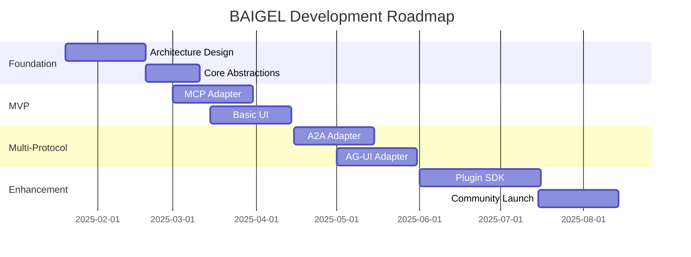

# BAIGEL Project Roadmap

## Purpose
This document outlines the planned development path for the BAIGEL protocol-agnostic agent UI project, including key milestones, features, and timelines.

## Classification
- **Domain:** Planning
- **Stability:** Dynamic
- **Abstraction:** Structural
- **Confidence:** Evolving

## Content

### Roadmap Overview

BAIGEL development follows a phased approach, starting with core architecture and a single protocol (MCP), then expanding to multi-protocol support, and finally achieving full plugin ecosystem maturity. Each phase builds on the previous, with continuous refinement based on real-world usage.

### Current Phase

**Phase: Foundation & Architecture**
**Status: In Progress**

Currently defining the core abstraction layers and plugin architecture based on extensive research into existing protocols and failed attempts at protocol abstraction. Focus is on avoiding the pitfalls identified in systems like Agno that became too coupled to specific implementations.

### Upcoming Milestones

#### Architecture Complete
- **Target Date:** Feb 2025
- **Status:** In Progress
- **Description:** Complete design of four-layer architecture with clear boundaries
- **Key Deliverables:**
  - Protocol abstraction layer specification
  - Message format definition
  - Plugin interface design
  - State management architecture
- **Dependencies:**
  - Research analysis complete
  - Key architectural decisions documented

#### MCP Adapter MVP
- **Target Date:** Mar 2025
- **Status:** Not Started
- **Description:** First working protocol adapter demonstrating the architecture
- **Key Deliverables:**
  - MCP protocol adapter
  - Basic chat UI
  - Tool execution support
  - Connection management
- **Dependencies:**
  - Architecture complete
  - MCP specification stable

### Feature Timeline

#### Phase 1: Foundation & Architecture
- **Timeline:** Jan 2025 - Feb 2025
- **Theme:** Establish robust architectural foundation
- **Features:**
  - Four-layer architecture design - Priority: High
  - Plugin system specification - Priority: High
  - Message bus design - Priority: High
  - State management pattern - Priority: High
  - Testing strategy - Priority: Medium

#### Phase 2: MVP with MCP
- **Timeline:** Mar 2025 - Apr 2025
- **Theme:** Prove architecture with single protocol
- **Features:**
  - MCP protocol adapter - Priority: High
  - Basic chat interface - Priority: High
  - Tool execution UI - Priority: High
  - Error handling - Priority: Medium
  - Basic authentication - Priority: Medium

#### Phase 3: Multi-Protocol Support
- **Timeline:** Apr 2025 - Jun 2025
- **Theme:** Validate abstraction with protocol diversity
- **Features:**
  - A2A protocol adapter - Priority: High
  - AG-UI protocol adapter - Priority: High
  - Protocol switching UI - Priority: High
  - Capability negotiation - Priority: High
  - Unified auth layer - Priority: Medium

### Release Strategy

- **Alpha Releases**: Internal testing with each protocol adapter
- **Beta Releases**: Community testing starting with MCP support
- **v1.0 Release**: When 3 protocols work reliably with < 10ms overhead
- **Versioning**: Semantic versioning with protocol compatibility matrix
- **Distribution**: npm packages, Docker images, browser extension

### Resource Allocation

- **Core Team**: Focus on architecture and first 3 adapters
- **Community**: Encouraged to build additional protocol adapters
- **Documentation**: Parallel effort throughout all phases
- **Testing**: Automated testing for each adapter

### Risk Assessment

| Risk | Impact | Likelihood | Mitigation Strategy |
|------|--------|------------|---------------------|
| Protocol specs change | High | Medium | Version adapters, maintain compatibility |
| Abstraction too complex | High | Medium | Start simple, iterate based on usage |
| Performance overhead | High | Low | Benchmark early, optimize critical paths |
| Low adoption | Medium | Medium | Clear value prop, great developer experience |
| Protocol diversity too high | High | Medium | Plugin architecture, community contributions |

### Roadmap Review Process

- **Weekly**: Team sync on current phase progress
- **Monthly**: Milestone review and adjustment
- **Quarterly**: Strategic roadmap revision
- **Continuous**: Community feedback integration

## Relationships
- **Parent Nodes:** [foundation/project_definition.md]
- **Child Nodes:** [planning/milestones.md]
- **Related Nodes:** 
  - [foundation/structure.md] - implements - Structure supports roadmap features
  - [processes/creation.md] - executes - Creation processes execute roadmap items

## Navigation Guidance
- **Access Context:** Use this document when planning work, prioritizing features, or communicating timelines
- **Common Next Steps:** After reviewing the roadmap, typically explore specific milestones or feature details
- **Related Tasks:** Sprint planning, resource allocation, stakeholder communication
- **Update Patterns:** This document should be updated quarterly or when significant changes to the plan occur

## Metadata
- **Created:** 2025-08-20
- **Last Updated:** 2025-08-20
- **Updated By:** Claude/Assistant

## Change History
- 2025-08-20: Initial BAIGEL roadmap created with 5-phase development plan
